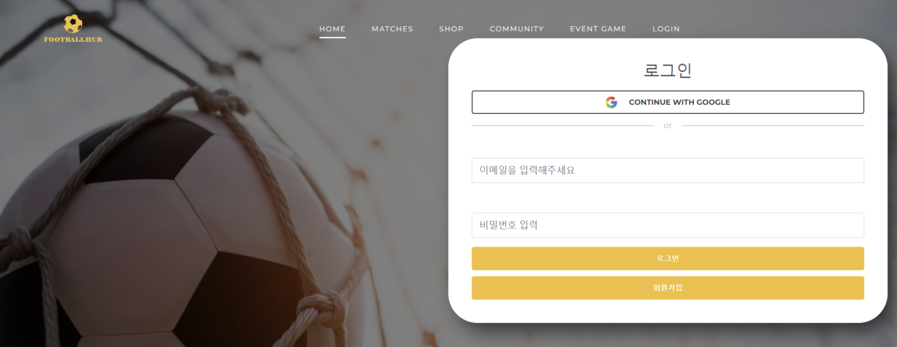
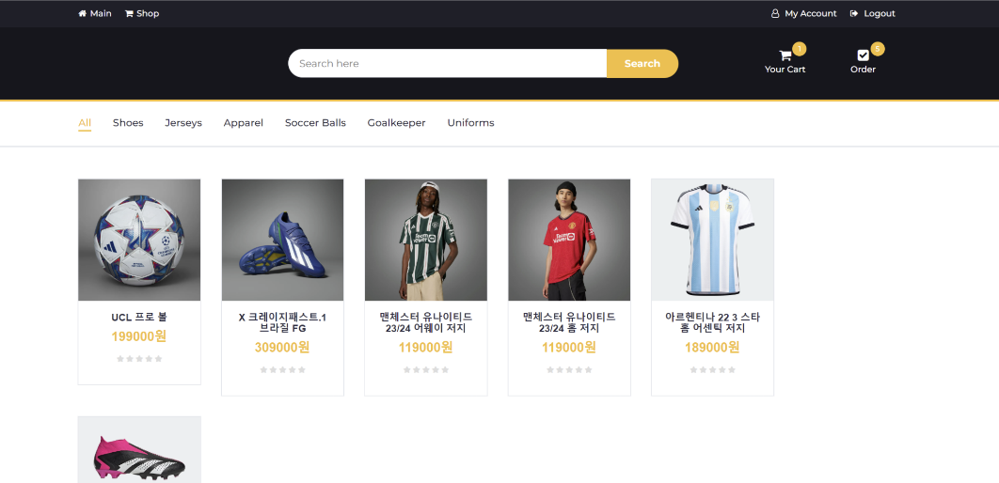
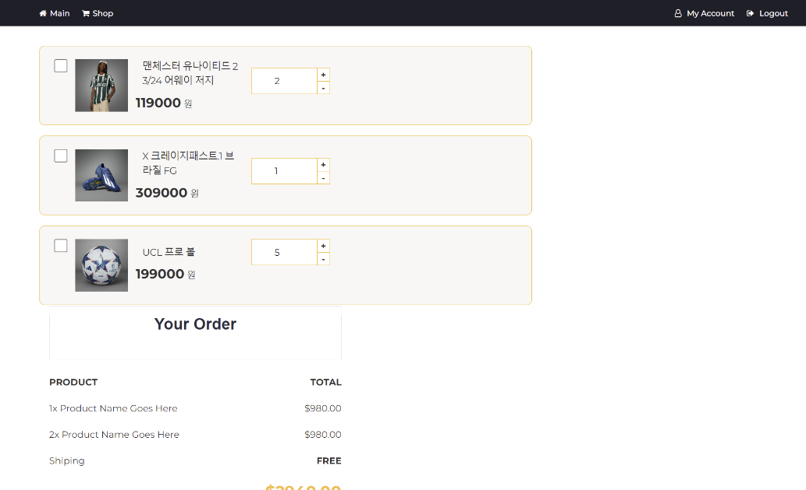
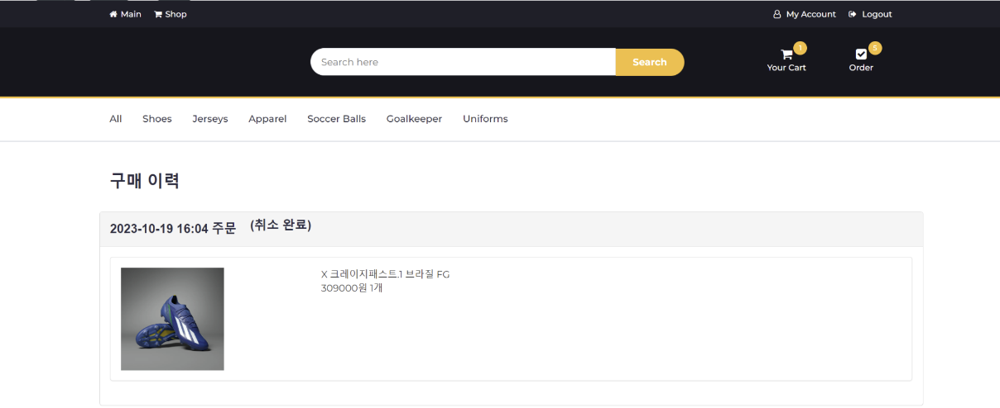
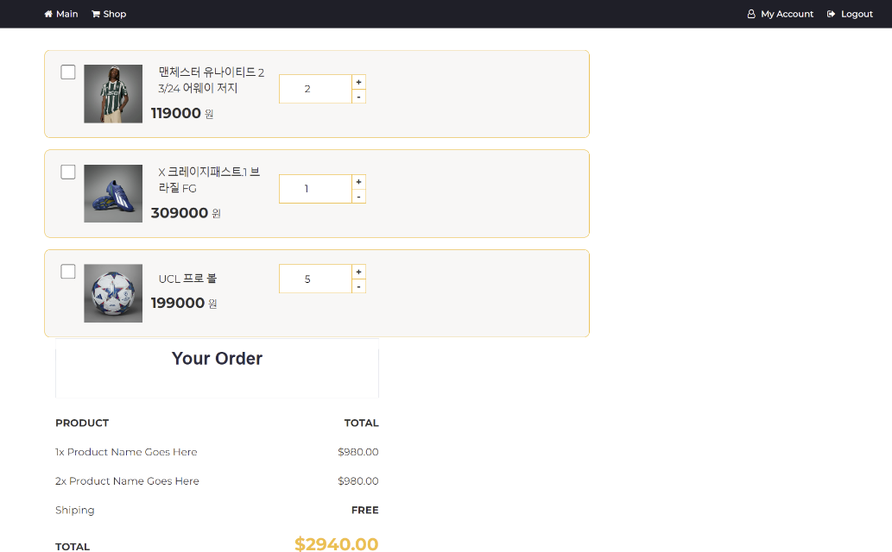
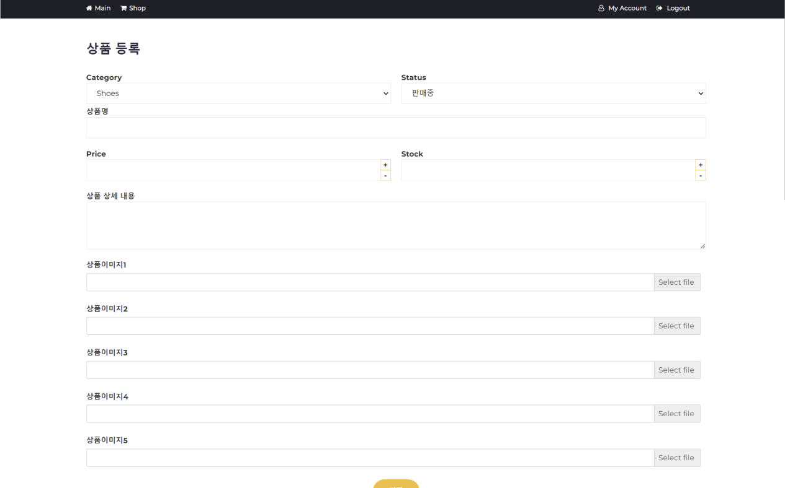

# FootballHub
### 프로젝트 소개
축구 애호가를 위한 올인원 솔루션. 축구 상품 구매부터 축구 중계일정 조회, 축구 애호가들과의 커뮤니티, 애장품 컬렉션 등 다양한 기능 제공

### 기획 배경
축구에 관심을 가지는 사람들을 위한 사이트 필요성

### 주요 기능
- 회원가입/로그인/로그아웃(+ OAuth2.0)
- 상품 등록/조회/삭제
- 장바구니 등록/조회/삭제
- 주문 추가/조회/취소
- 커뮤니티(게시판)
- 축구 중계 스케줄 확인
- 미니게임
- 실시간 채팅
- 챗봇

### 이지윤 담당 역할
- Oauth를 통한 인증인가 구현
- 카테고리화, 댓글, 평점 기능 구현
  - 댓글, 평점은 ajax를 통한 데이터통신과 DOM조작으로 구현
- 메인, 로그인, 상세, 주문 페이지 디자인 적용

## UI 캡처

